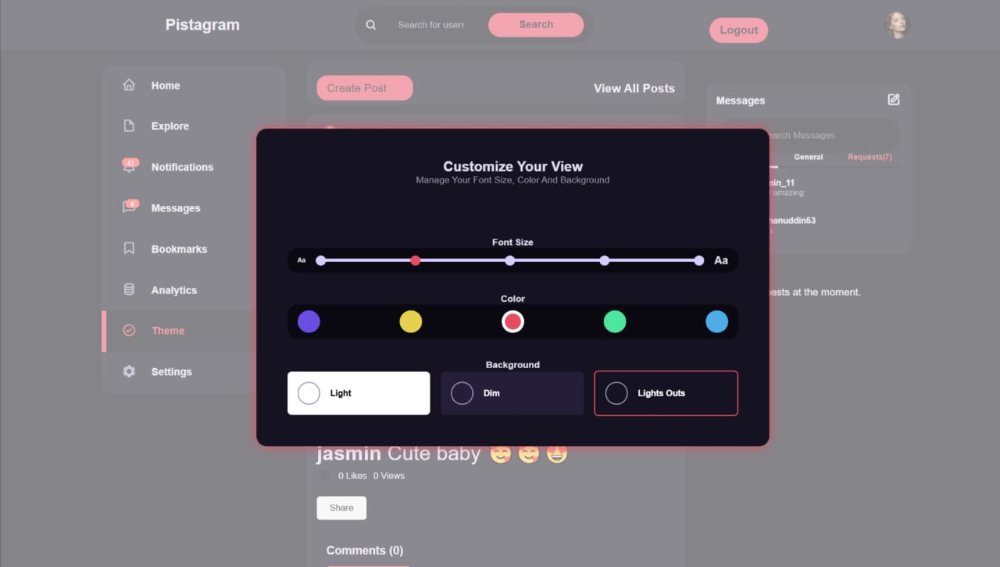
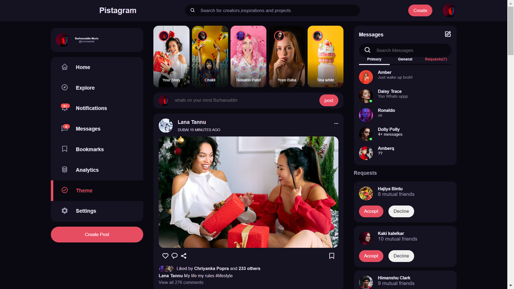
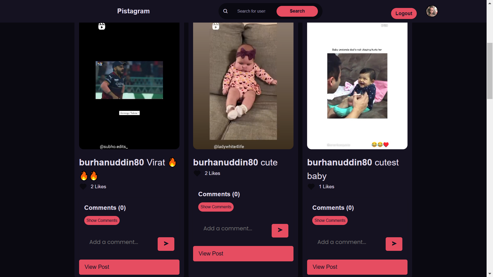
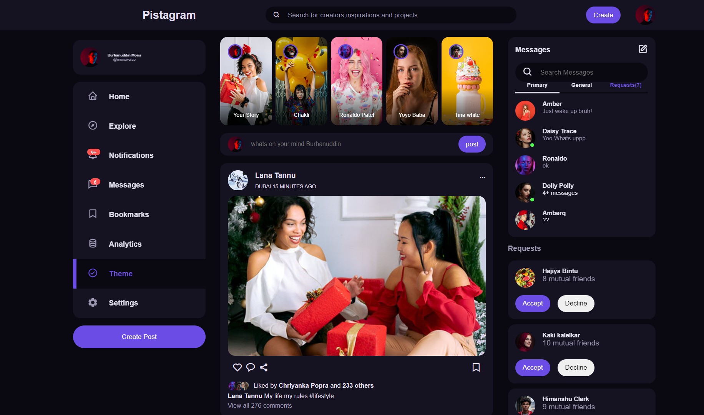

# Social-media-website
User Authentication: Users can create accounts, log in, and send friend requests to others.Post Creation: Users can upload and share images and videos.Interactivity: Posts can be liked, commented on, and shared.Profile Management: Users can customize their profiles with personal information and a profile picture.Theme Customization: The app supports light, dark, and white themes, allowing users to adjust colors, fonts, and backgrounds to their preference.

  
link: https://pistagramapp.pythonanywhere.com/

     

